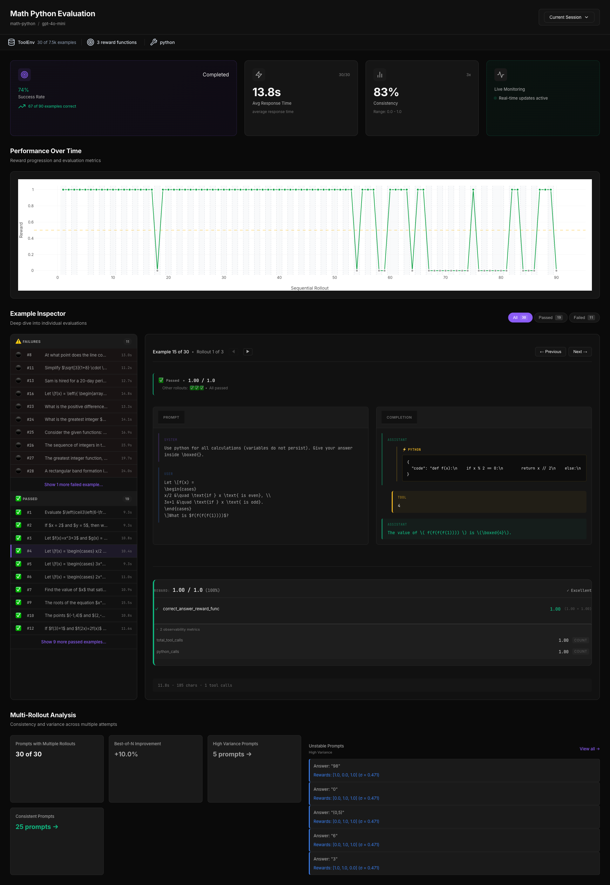

# Verifiers Monitor

**Real-time observability for RL training and evaluation**

Running RL experiments without visibility into rollout quality, reward distributions, or failure modes wastes time. Monitor gives you live tracking, per-example inspection, and programmatic access—see what's happening during runs and debug what went wrong after.



## Quick Start

```python
import verifiers as vf
from verifiers_monitor import monitor

# One-line integration
env = monitor(vf.load_environment("gsm8k"))
results = env.evaluate(client, model="gpt-5-mini")
# Dashboard automatically launches at localhost:8080
```

⚠️ **Training monitoring**: Not yet supported (coming soon)

See `scripts/01_monitor.py` and `scripts/02_access_data.py` for examples.

## Installation

```bash
pip install verifiers-monitor
```

## What You Get

- Live progress tracking with WebSocket updates (know when long runs stall)
- Real-time reward charts showing trends as rollouts complete
- Per-example status: see which prompts pass, which fail, why
- Inspect failures: view full prompts, completions, and reward breakdowns
- Multi-rollout analysis: identify high-variance examples where model is inconsistent
- Reward attribution: see which reward functions contribute most to scores
- Session comparison: track metrics across training iterations or evaluation experiments

## Dashboard

Launches automatically at `http://localhost:8080`. Shows success rates, response times, consistency metrics, and per-example breakdowns in real-time.

## Programmatic Analysis

Access rollout data for custom analysis and debugging:

```python
from verifiers_monitor import MonitorData

data = MonitorData()

# Find worst-performing examples to understand model weaknesses
session = data.get_latest_session(env_id="math-python")
worst = data.get_top_failures(session.session_id, n=10)
for ex in worst:
    print(f"Example {ex.example_number}: avg={ex.mean_reward:.2f}, std={ex.std_reward:.2f}")
    # Check if unstable (high variance across rollouts)
    if ex.is_unstable(threshold=0.3):
        print(f"  ⚠️ Unstable: variance {ex.std_reward:.2f}")
    # Get best/worst rollouts
    best = ex.get_best_rollout()
    print(f"  Best: {best.reward:.2f}, Worst: {ex.get_worst_rollout().reward:.2f}")

# Inspect prompts and completions
failures = data.get_failed_examples(session.session_id, threshold=0.5)
for ex in failures[:5]:
    rollout = ex.rollouts[0]
    # Use convenience properties
    print(f"Prompt: {rollout.prompt_messages[0]['content'][:50]}...")
    if rollout.has_tool_calls:
        print("  Contains tool calls")

# Export to pandas for custom analysis
df = data.to_dataframe(session.session_id)
variance_analysis = df.groupby('example_number')['reward'].std()
high_variance = variance_analysis[variance_analysis > 0.3]
print(f"Found {len(high_variance)} unstable examples")
```

---
Questions? Create an Issue or reach out on [X](https://x.com/kaushik_bokka)

Happy building! 🚀
